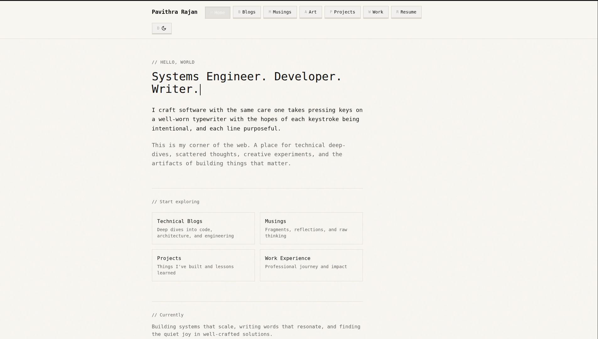

# Personal Portfolio


[](https://app.netlify.com/sites/pavithra-dev/deploys)

This is my revamped personal portfolio website showcasing my technical writing, visual art, musings, projects, and professional journey.
The initial structure was generated using **Lovable**, while all content, design refinements, and major architectural changes are my own.

The site is deployed on **Netlify** and hosted via **Squarespace**, built with **React** and styled using **Tailwind CSS**.

---

## Getting Started

```bash
npm i
npm run dev
```

---

## Architecture & Pages

The project follows a clean, route-driven structure with clear separation between content listings and detailed views.

### Art (`Art.tsx`)

Displays a responsive grid-based collage of my artwork, focusing on visual balance and minimalism.

### Blogs

* **`Blogs.tsx`**:  Lists all blog posts with excerpts for quick discovery.
* **`BlogPost.tsx`**: Renders full blog content using custom Markdown parsing to handle:

  * Headings
  * Images
  * Links
  * Rich text formatting

### Musings

* **`Musings.tsx`**: Lists all musings posts with excerpts for quick discovery.
* **`MusingsPost.tsx`**: Full-length musings rendered using the same Markdown conventions as blogs.

### Work (`Work.tsx`)

A chronological timeline highlighting my professional journey, roles, and experiences.

### Projects & Coursework (`Projects.tsx`)

A collection of interactive widgets representing:

- Personal projects
- Academic coursework

Each entry emphasizes intent, scope, and technical stack used.

### Resume (`Resume.tsx`)

A minimal, distraction-free resume view with a direct **PDF download option**.

### Not Found (`NotFound.tsx`)

Custom 404 page for non-existent routes, maintaining visual consistency with the rest of the site.

---

## Design Philosophy

- Monochrome-first visual language
- Strong focus on typography and layout
- Content-driven navigation
- Minimal UI with intentional motion and spacing

## Screenshots


